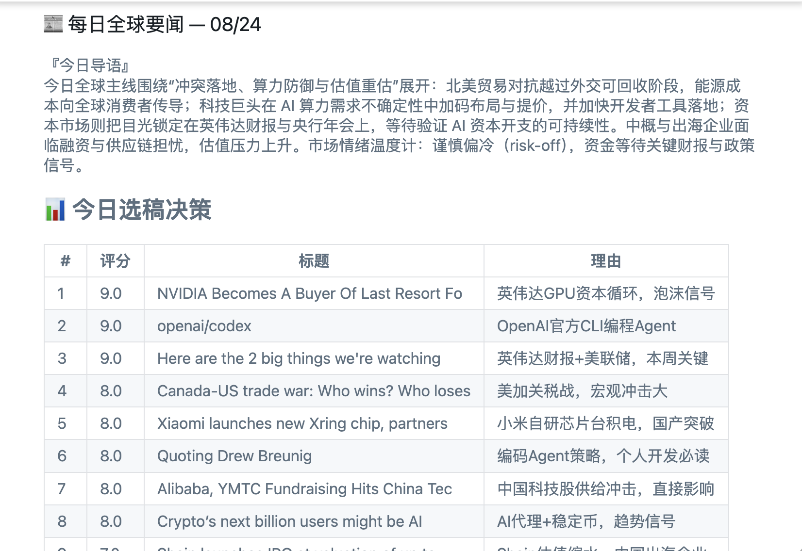

# 📰 AI Briefing

> Fork of [llqh111/daily-news-digest](https://github.com/llqh111/daily-news-digest). Renamed to `ai-briefing` and refined for resume-friendly presentation.

Twice a day, automatically pull news from 20 global outlets → DeepSeek AI writes a deep-dive digest in Chinese → delivered to your WeChat and Telegram. Runs entirely on GitHub Actions for free — set it up once, then just read.

## 📱 真实运行产物（每日 9:00 推送至微信）

> 由本项目每天自动生成。以下是 2026-08-24 抓取的当日早报预览：



*导语 + 今日选稿决策表（带 AI 评分 1-10、标题中英对照、简明理由）—— 所有内容均由 DeepSeek 实时生成，零人工参与。*

---

## 本仓库相对上游的改进

- ⏰ **改用 GitHub Actions 自带 cron** — 去掉原作者的外部 cron-job.org 依赖，少一个挂的点
- 🌐 **新增中英双语开关** — 通过 `DIGEST_LANG=zh/en/bilingual` 运行时切换，无需改代码
- 📖 **新增 5 步傻瓜部署指南** — 见 [部署指南.md](./部署指南.md)
- 🔒 **修复 fork 自带历史记录导致的"今天已推过"误判** — 详见 commit 历史

## What it does

- **Auto-fetch** — World news (BBC / DW / AP / Reuters / Nikkei / Al Jazeera / Guardian / SCMP) + Tech (MIT Tech Review / Hacker News / Ars Technica / The Verge / TechCrunch / Wired / 36kr) + Finance (FT / CNBC / CoinDesk / Bloomberg)
- **Smart scoring** — Multi-layer ranking by keyword importance, source trust, freshness, and clickbait detection
- **Deduplication** — Stories covered by multiple outlets are merged into one, labeled "reported by N sources"
- **Full-text AI digest** — Fetches the full article (not just the RSS snippet), feeds it to DeepSeek, produces a reasoned summary with context and judgment
- **3-layer hallucination guard** — Cross-article number verification → prompt-level self-audit → output scan for future dates / fabricated figures
- **Multi-channel delivery** — WeChat (via Server酱) + Telegram; runs on GitHub's overseas runners so it's never blocked
- **Failure alerts** — Any error immediately pushes a fault notification to all available channels
- **Cross-session dedup** — Morning and evening editions never repeat the same story

## How it works

```
20 RSS feeds → time / keyword / source scoring → cluster dedup → full-text fetch
→ DeepSeek AI writes Chinese digest → WeChat / Telegram delivery
```

## Quick start

### Prerequisites

- A GitHub account (for Actions)
- DeepSeek API Key — sign up at [platform.deepseek.com](https://platform.deepseek.com); ¥10 (~$1.40) lasts months
- Server酱 SendKey — sign up at [sct.ftqq.com](https://sct.ftqq.com), bind WeChat, get your SendKey
- *(Optional)* Telegram Bot Token + Chat ID — useful outside China where Server酱 may be slow

### 1. Fork & clone

```bash
git clone https://github.com/YOUR_USERNAME/daily-news-digest.git
cd daily-news-digest
```

### 2. Configure environment variables

```bash
cp .env.example .env
```

Edit `.env` and fill in your keys:

```ini
DEEPSEEK_API_KEY=sk-your-deepseek-key
SERVERCHAN_SENDKEY=SCTyour-sendkey
# Multiple recipients — comma-separated:
# SERVERCHAN_SENDKEY=SCTyourkey,SCTfriendkey

# Optional: Telegram
TELEGRAM_BOT_TOKEN=123456:ABCdef...
TELEGRAM_CHAT_ID=your-numeric-id
```

### 3. Run locally to verify

```bash
pip install -r requirements.txt
python main.py
```

If everything is set up correctly, you should receive a digest on WeChat / Telegram within a minute.

### 4. Enable automatic scheduling on GitHub

1. Fork this repository
2. Go to `Settings → Secrets and variables → Actions` and add these secrets:
   - `DEEPSEEK_API_KEY`
   - `SERVERCHAN_SENDKEY`
   - `TELEGRAM_BOT_TOKEN` *(optional)*
   - `TELEGRAM_CHAT_ID` *(optional)*
3. Actions is enabled by default — digests run at **08:00 and 20:00 Beijing time** every day
4. You can also trigger a run manually via `Actions → Run workflow`

> ⚠️ **Note**: The workflow requires `contents: write` permission because it commits `sent_articles.json` after each run to track delivered articles and prevent duplicates.

## Customization

All tunable parameters live in `digest/config.py`. Editing this file changes "editorial preferences" without touching any business logic.

### Change news sources

```python
RSS_FEEDS = [
    {"name": "BBC World", "url": "http://feeds.bbci.co.uk/news/world/rss.xml", "category": "国际"},
    # Add a new source: one dict, pick a name, paste the RSS URL, set category
]
```

### Tune what counts as important

Three keyword lists, all lowercase:

```python
HIGH_SIGNAL_KEYWORDS = ["war", "ceasefire", "nuclear", ...]   # +3 points
MEDIUM_SIGNAL_KEYWORDS = ["ai", "apple", "earnings", ...]     # +1 point
LOW_VALUE_KEYWORDS = ["celebrity", "quiz", "gossip", ...]     # -2 points
```

### Prioritize sources you trust more

```python
SOURCE_TRUST = {
    "Reuters": 2,     # +2 points
    "The Verge": 1,   # +1 point
    # unlisted sources default to 0
}
```

### Other parameters

| Parameter | Default | Description |
|-----------|---------|-------------|
| `MAX_PER_FEED` | 8 | Max articles fetched per RSS source |
| `TIME_WINDOW_HOURS` | 24 | Only keep articles published within this window |
| `FINAL_PICK` | 13 | Total articles in the final digest |
| `CATEGORY_QUOTA` | `{"国际":6, "科技":4, "财经":3}` | Per-category cap (sums to `FINAL_PICK`; each category ranks independently — no cross-category competition) |
| `FULLTEXT_MAX_CHARS` | 2800 | Max characters per article fed to the AI (controls token cost) |
| `BATCH_SIZE` | 7 | Articles per AI call; auto-splits if exceeded |

## Diagnostics & testing

```bash
# Full diagnostic: checks .env → DeepSeek API → Server酱 → all RSS feeds
python diagnose.py

# RSS connectivity test: checks which sources are alive
python test_rss.py
```

## Project structure

```
daily-news-digest/
├── main.py                  # Entry point (orchestrates: fetch → score → AI → push)
├── digest/                  # Core business logic
│   ├── config.py            # ⭐ Config center (RSS feeds / keywords / trust scores / constants)
│   ├── fetch.py             # RSS + full-text scraping
│   ├── scoring.py           # Keyword / source / freshness scoring
│   ├── triage.py            # Cluster deduplication
│   ├── topics.py / scout.py # Topic selection + search-augmented scout agent
│   ├── ai.py                # DeepSeek API calls + digest writing
│   ├── factcheck.py         # Hallucination guard
│   ├── bio.py               # Life-sciences section (dedicated single slot)
│   ├── push.py              # WeChat / Telegram delivery
│   └── storage.py           # Delivery log read/write (dedup)
├── test_core.py             # Core unit tests (CI gate — failing tests block delivery)
├── test_rss.py              # RSS connectivity test
├── diagnose.py              # Full-chain diagnostic (API / push / RSS)
├── requirements.txt         # Python dependencies
├── .env.example             # Environment variable template
├── .gitignore
├── LICENSE                  # MIT License
├── sent_articles.json       # Delivery log (auto-generated, prevents duplicates)
├── digests/                 # Sample digest archive
├── .github/workflows/
│   └── daily-digest.yml     # GitHub Actions scheduled workflow
└── 运行.bat / 诊断.bat       # Windows double-click launchers
```

## FAQ

**Q: Why can't some sources fetch full text?**
A: Reuters, AP, and Bloomberg don't expose public RSS. The project uses Google News as a proxy. Their summaries still participate in scoring, but full text is marked "summary only."

**Q: Not receiving WeChat notifications?**
A: GitHub Actions runs on overseas servers; Server酱 occasionally drops packets from outside China. The project has built-in 3x retry + Telegram as a fallback channel.

**Q: How do I add more recipients?**
A: Server酱 supports multiple SendKeys comma-separated: `SERVERCHAN_SENDKEY=SCTyourkey,SCTfriendkey`

**Q: What if DeepSeek goes down?**
A: No fallback AI provider yet (planned). You'll receive a failure alert push.

**Q: Can I swap in a different AI model?**
A: Yes. Change the API endpoint and model name in `_call_deepseek_once()` in `digest/ai.py`. Any OpenAI-compatible API works (Gemini, Claude, GPT, etc.).

## License

This project is released under the [MIT License](LICENSE) — free to use, modify, and redistribute. Provided as-is; the author is not liable for any consequences of use.
